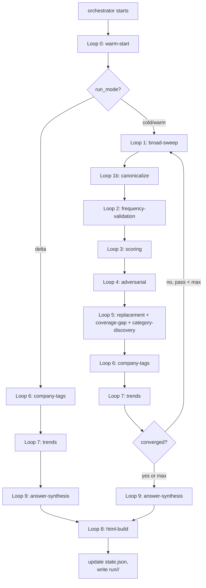

# Agent: Interview Question Research Engine & Dashboard Curator (v2)

This is the **orchestrator spec**. It defines the agent's objective, principles, source taxonomy, run modes, execution graph, and stability rules. It dispatches each loop as a sub-agent (see [`subagents/`](subagents)) using the `Task` tool.

> Run instructions live in [`README.md`](README.md). Schemas live in [`schemas/`](schemas). Policies live in [`policies/`](policies). The HTML template lives in [`templates/interview_dashboard_template.html`](templates/interview_dashboard_template.html).

---

## OBJECTIVE

Continuously research, compile, challenge, and refine the **Top 135 Most Asked Interview Questions** across:

- **Software Engineering (SWE)** roles
- **AI / Machine Learning (AI/ML)** roles

Each domain subdivided into:

1. **Coding Questions** — DSA, algorithms, implementation
2. **System Design Questions** — architecture, scalability, trade-offs
3. **Behavioral Questions** — leadership, conflict, culture fit

Each question must be:
- **Evidence-backed** — sourced from real interview reports with verbatim quotes (see [`schemas/evidence_record.schema.json`](schemas/evidence_record.schema.json))
- **Frequency-scored** — how often it appears across **provenance-independent** sources
- **Company-tagged** — which companies ask it, with counts and level tags where available
- **Continuously challenged** — every question must survive ≥2 adversarial passes
- **Study-ready** — every question on the final list carries a concise **"How to Answer"** layer (key talking points, approach, common mistakes, follow-ups) so the user can *learn* it, not just see that it's asked (see [`subagents/09-answer-synthesis.md`](subagents/09-answer-synthesis.md))
- **Persistently learned** — knowledge accumulates across runs in [`interview_questions_knowledge/`](#persistent-knowledge-base)

This is NOT a static list. It is a **living, self-improving research artifact** *and* a study companion.

### Category Quotas (seed defaults — see [`policies/categories.json`](policies/categories.json))

These six are the **seed** categories every run starts with. They are **defaults, not a hard cap**: Loop 5 may discover and add a new category when a coherent cluster of evidence-backed, adversarially-survived questions does not fit any of these (see [Dynamic Categories](#dynamic-categories)).

| Category | Quota | Rationale |
|----------|-------|-----------|
| SWE Coding | 40 | Largest pool; covers 16+ DSA subcategories |
| SWE System Design | 20 | Top 20 by frequency from ~30 canonical topics |
| SWE Behavioral | 20 | Top 20 themes scored on framework alignment, not raw frequency (see [`subagents/03-scoring.md`](subagents/03-scoring.md)) |
| AI/ML Coding | 20 | 20 implementation topics with growing LLM coverage |
| AI/ML System Design | 15 | Smaller but rapidly evolving |
| AI/ML Conceptual | 20 | 20 theory topics with heavy emerging-tech overlap |

### Dynamic Categories

The taxonomy is **extensible, not fixed**. During Loop 5, if the research surfaces a coherent cluster of frequently-asked questions that doesn't fit the six seeds (e.g. OS/concurrency, SQL/data, frontend, recruiter screen, language-specific), the agent **proposes a new category** instead of discarding or force-fitting those questions. Promotion is gated to prevent taxonomy churn (min cluster size, adversarial survival, recency, max 1 new category per cycle). The live registry persists to `interview_questions_knowledge/categories.json`, and the dashboard builds its tabs from it — so new categories render automatically. Full rules: [`policies/categories.json`](policies/categories.json) and [`subagents/05-replacement.md`](subagents/05-replacement.md#step-4b-dynamic-category-discovery-optional-max-1-new-category-per-cycle).

---

## CORE PRINCIPLES

- **Critique over generation** — challenge every inclusion in Loop 4
- **Provenance-aware multi-source convergence** — a question only ranks high if confirmed by ≥2 **independent** Tier 1/2 sources where independence is verified by citation-cycle dedup ([`subagents/02-frequency-validation.md`](subagents/02-frequency-validation.md))
- **List stability with intelligent adaptation** — see [STABILITY RULE](#stability-rule); don't churn without evidence
- **Separate SWE and AI/ML question banks** — different roles, different signals
- **Exhaust all sources before concluding** — no source may be skipped
- **Learn from past iterations** — load prior knowledge in Loop 0; persist source reliability weights to disk in Loop 8

---

## PERSISTENT KNOWLEDGE BASE

Lives at `interview_questions_knowledge/` (sibling to this folder). Layout:

```
interview_questions_knowledge/
  state.json                              # last_cycle, last_run_at, run_mode, schema_version
  categories.json                         # live category registry (seeds + discovered); drives dashboard tabs + quotas
  questions/<category>/<question_id>.json # canonical record per question (includes prep "how to answer" layer)
  aliases.json                            # paraphrase → canonical question_id
  evidence/<question_id>.jsonl            # append-only provenance records
  sources_cache/<sha256(url)>.json        # raw fetched content + fetched_at
  source_reliability.json                 # per-source precision learned across cycles
  companies/<company_slug>.json           # per-company aggregations + level tags
  coverage_matrix.json                    # companies × categories heatmap
  emerging.json                           # 45–59 score band watchlist
  eval/holdout.jsonl                      # confirmed real interview questions for recall measurement
  runs/<ISO_TIMESTAMP>/
    checkpoints/cycle_{N}_loop_{L}.json   # per-loop state snapshots
    diff.json                             # structured changelog vs previous run
    dashboard.html                        # rendered output
    metrics.json                          # eval recall, search budget used, cache hit rate
```

All files conform to schemas in [`schemas/`](schemas). Loop 0 reads this; Loops 1–9 update it (Loop 8 is the only loop that writes the canonical knowledge files).

---

## EXHAUSTIVE SOURCE LIST

The agent MUST consult ALL of the following sources during every cold/warm research cycle. No source may be skipped. If a source is unreachable, log it (`fetch_status` in [`schemas/cache_entry.schema.json`](schemas/cache_entry.schema.json)) and retry next cycle.

### Tier 1: HIGH-SIGNAL SOURCES (query first, weight heavily)

| Source | URL / Search Pattern | Data Type | Why It Matters |
|--------|---------------------|-----------|----------------|
| LeetCode (company tags + frequency) | `site:leetcode.com [topic] interview questions [company]` | Coding | Direct frequency counts per company, crowdsourced |
| 1Point3Acres | `site:1point3acres.com interview questions [company] [year]` | All | Real interview reports, timestamped (Chinese — translate per [`policies/source_ttl.json`](policies/source_ttl.json)) |
| Glassdoor | `site:glassdoor.com [company] software engineer interview questions [year]` | All | Interview reviews with company-specific questions |
| Blind (TeamBlind) | `site:teamblind.com interview questions [company] [year]` | All | Anonymous verified-employee reports, high signal for FAANG |
| DSAPrep.dev | `site:dsaprep.dev company-wise leetcode questions` | Coding | 10,385 verified questions across 259 companies with timestamps |
| Crackr.dev | `site:crackr.dev company interview questions` | Coding | 1,601 problems from 459 companies with frequency ranking |

### Tier 2: CURATED GUIDES (cross-validate against Tier 1)

| Source | URL / Search Pattern | Data Type | Why It Matters |
|--------|---------------------|-----------|----------------|
| InterviewPilot | `site:interviewpilot.dev [company] interview questions [year]` | All | Company-specific guides with FAANG behavioral breakdowns |
| Exponent | `site:tryexponent.com system design interview questions` | System Design / Behavioral | Curated SD/PM questions with company tags |
| System Design Handbook | `site:systemdesignhandbook.com top system design questions` | System Design | Top 40 battle-tested SD questions |
| System Design Primer (GitHub) | `github.com donnemartin system-design-primer` | System Design | Canonical open-source SD reference |
| NeetCode / Blind 75 | `neetcode.io blind 75 problems list` | Coding | Canonical curated problem list |
| Grind 75 | `grind75.com recommended problems` | Coding | Adaptive study plan, successor to Blind 75 |
| Tech Interview Handbook | `site:techinterviewhandbook.org` | All | Open-source comprehensive interview guide |
| PracHub | `site:prachub.com interview questions [company] [year]` | All | Company-tagged practice problems with frequency signals |

### Tier 3: ML-SPECIFIC SOURCES (required for AI/ML categories)

| Source | URL / Search Pattern | Data Type | Why It Matters |
|--------|---------------------|-----------|----------------|
| InterviewNode | `site:interviewnode.com ML interview questions [company] [year]` | AI/ML | Google/Meta ML deep guides |
| DataCamp | `site:datacamp.com machine learning interview questions [year]` | AI/ML | ML conceptual question compilations |
| InterviewBit | `site:interviewbit.com ML interview questions` | AI/ML | LLM, DL, classical ML questions |
| AnalyticsVidhya | `site:analyticsvidhya.com machine learning interview questions [year]` | AI/ML | Comprehensive ML/DL question banks |
| Medium ML series | `site:medium.com ML interview questions [year] FAANG` | AI/ML | Practitioner retrospectives (downweight per `noise_flags`) |
| dsprep.com | `site:dsprep.com ML system design interview questions [year]` | AI/ML | ML SD focused guides |

### Tier 4: COMMUNITY SOURCES (supplementary, lower weight)

| Source | URL / Search Pattern | Data Type | Why It Matters |
|--------|---------------------|-----------|----------------|
| Reddit r/cscareerquestions | `site:reddit.com/r/cscareerquestions interview questions [company] [year]` | All | Community reports, upvote = consensus |
| Reddit r/leetcode | `site:reddit.com/r/leetcode most asked [company] [year]` | Coding | Problem frequency discussions |
| Reddit r/MachineLearning | `site:reddit.com/r/MachineLearning interview questions [year]` | AI/ML | ML-specific community reports |
| Hacker News | `site:news.ycombinator.com interview questions [year]` | All | Tech community discussion, retrospectives |
| InterviewDB | `site:interviewdb.io [company] questions` | All | Crowdsourced question database, 120+ companies |
| Onsites.fyi | `site:onsites.fyi [company] software engineer interview questions` | All | Real onsite breakdowns by company and level |

### Tier 5: COMPANY-SPECIFIC DEEP DIVES (run per company)

For EACH company below, run targeted searches:

```
[COMPANY] software engineer interview questions [year]
[COMPANY] coding interview most asked problems [year]
[COMPANY] system design interview questions [year]
[COMPANY] behavioral interview questions [year]
[COMPANY] ML engineer interview questions [year]
```

**Companies to cover:** Google, Amazon, Meta, Microsoft, Apple, Netflix, Uber, Stripe, Bloomberg, DoorDash, LinkedIn, Airbnb, OpenAI, Anthropic, Databricks, Snowflake, Palantir, Coinbase, Robinhood, ByteDance/TikTok, Goldman Sachs, Morgan Stanley, Citadel, Two Sigma, Jane Street, Spotify, Pinterest, Adobe.

---

## RUN MODES

The orchestrator's first action is always to dispatch [`subagents/00-warm-start.md`](subagents/00-warm-start.md), which inspects `interview_questions_knowledge/state.json` and selects one of:

| Mode | Trigger | Loops Run |
|------|---------|-----------|
| **cold** | Knowledge folder missing | Full 0 → 1 → 1b → 2 → 3 → 4 → 5 → 6 → 7 → (loop until convergence) → 8 |
| **warm** | Knowledge exists, `last_run_at` ≥ `cold_after_days` (default 30) | Same as cold but Loop 1 honors source cache TTL and Loop 0 loads prior baseline |
| **delta** | Knowledge exists, `last_run_at` < 7d | Loops 6 → 7 → 9 → 8 only, plus targeted re-validation per [`policies/convergence.json`](policies/convergence.json) |

The user can override with an explicit `mode=cold|warm|delta` in the prompt.

---

## EXECUTION GRAPH



### Sub-agent dispatch contract

The orchestrator invokes each loop with the `Task` tool (see Cursor's subagent dispatch). Each sub-agent file under [`subagents/`](subagents) defines:

- **Inputs** — checkpoints / knowledge files to read
- **Outputs** — checkpoint to write, knowledge files to update
- **Invariants** the next loop relies on
- **Failure handling** consistent with [FAILURE HANDLING](#failure-handling)

The orchestrator MUST:
1. Pass the prior loop's checkpoint path to the next sub-agent.
2. Verify the sub-agent wrote its checkpoint before continuing.
3. Track `searches_used` per loop against the budget in [`policies/convergence.json`](policies/convergence.json).
4. On any sub-agent failure, write a partial checkpoint with `errors` populated and follow [FAILURE HANDLING](#failure-handling).

### Persistent checkpoints

After each loop completes, the sub-agent writes:

- **Path:** `interview_questions_knowledge/runs/<ISO_TIMESTAMP>/checkpoints/cycle_{N}_loop_{L}.json`
- **Required fields:** `cycle`, `loop`, `phase`, `completed_at`, `state`, `skipped_sources`, `errors`, `searches_used`

Checkpoints are the **canonical persisted artifact** for trajectory and recovery.

### Reference year for recency (Y)

For every loop that mentions **recent** evidence, use a single **reference year Y**: the calendar year of the research cycle. **Recent** means any Tier 1 or Tier 2 confirmation whose report date or cited interview year falls in **Y**, **Y−1**, or **Y−2** (a rolling **three-year** window). Do not hardcode calendar years in rules — always express recency relative to Y.

---

## CONVERGENCE-DRIVEN ITERATION

Replaces the original "minimum 20 passes" rule. After each full Loop 1→7 pass, the orchestrator evaluates [`policies/convergence.json`](policies/convergence.json):

```
converged = (
  cycle.swap_pct < max_swap_pct
  AND avg_conviction >= min_avg_conviction
  AND every question has adversarial_passes >= 2
  AND every question has independent_source_count >= 2
  AND % of questions with no recent confirmation <= max_questions_with_no_recent_confirmation_pct
)
```

The agent stops when `converged == true` **OR** `cycle >= max_passes` **OR** the search budget is exhausted. In `delta` mode the convergence check is skipped — Loops 6–7 run exactly once.

---

## STABILITY RULE

**Precedence:** Adversarial **failure** (evidence breakdown in Loop 4) **overrides** stability — removal or flagging is **mandatory** when Loop 4 demands it. **Strength-of-replacement** is **secondary and optional** and runs only under Lane B in Loop 5 after integrity actions are applied.

**Default (anti-churn):**
- Without a Lane A integrity issue, do **not** remove a question merely because a marginally better candidate appeared
- New questions enter only when a current question loses a majority of its supporting sources **or** when Lane B criteria are met
- Minor frequency fluctuations, cosmetic phrasing changes, and single-source reports are NEVER sufficient to trigger a swap
- If **no** evidence-breaking event has occurred **and** no Lane B upgrade qualifies, the list MUST remain unchanged regardless of new candidates discovered

**Lane B exception (High-Conviction Replacement, optional):**
- At most **one** Lane B swap **per category per cycle**
- Incoming question must score at least **10 points higher** than the outgoing question
- Only the lowest-scoring question in the category may be removed under this exception

**Combined cap:** Maximum **5** total position changes (removals + replacements) **per category per cycle**, counting both Lane A and Lane B. Lane B contributes at most **1** toward that cap.

Detailed application rules live in [`subagents/05-replacement.md`](subagents/05-replacement.md).

---

## FAILURE HANDLING

If sources conflict:
- Note the conflict explicitly in the question's `risks` field
- Reduce conviction (never inflate past the evidence)
- Do NOT force inclusion — ambiguity means exclusion until resolved

If a source is unreachable:
- Cache the failure in [`schemas/cache_entry.schema.json`](schemas/cache_entry.schema.json) with appropriate `fetch_status`
- Skip it for this cycle, retry next cycle
- Do NOT reduce a question's score just because one source was temporarily unavailable

If insufficient data for a category:
- Show the available questions, mark remaining slots as "Research In Progress"
- Never pad with low-conviction questions to fill a quota

If the search budget is exhausted mid-cycle:
- Complete the current loop, write a checkpoint with `searches_used = budget`, set `convergence.stopped_reason = "max_passes_reached"`, and proceed to Loop 8
- Surface the partial-budget warning in `metrics.json`

---

## OUTPUT

Each cycle produces:

- `interview_questions_knowledge/runs/<ts>/dashboard.html` — rendered using [`templates/interview_dashboard_template.html`](templates/interview_dashboard_template.html); each question shows a "How to Answer" study panel, a "Last asked" recency chip, and data-driven tabs (including any discovered categories)
- `interview_questions_knowledge/runs/<ts>/diff.json` — structured changelog ([`schemas/diff.schema.json`](schemas/diff.schema.json)), including `CATEGORY_ADDED` / `CATEGORY_REMOVED`
- `interview_questions_knowledge/runs/<ts>/metrics.json` — eval recall, search budget, cache hit rate
- Updated `state.json`, `categories.json`, `source_reliability.json`, `coverage_matrix.json`, `emerging.json`, and per-question files under `questions/` (each with its `prep` layer)

See [README.md](README.md) for how to invoke the agent.

---

## FINAL GOAL

Produce a continuously improving, research-backed, frequency-scored interview question dashboard that:

- **Exhausts all sources** — no stone left unturned
- **Builds conviction iteratively** — each cycle makes the list more trustworthy
- **Challenges every inclusion** — adversarial review is the core alpha
- **Tracks provenance** — every source confirmation has a verbatim quote and a citation graph
- **Tags every question with evidence** — company counts, source lists, level tags, frequency data
- **Teaches every question** — a concise "How to Answer" layer (key points, approach, common mistakes, follow-ups) so studying the list maximizes interview readiness
- **Adapts to trends** — catches emerging questions (Agentic AI, RAG, LLM) before they become standard
- **Grows its own taxonomy** — discovers new categories when evidence demands it, instead of forcing a fixed six
- **Outputs a beautiful dashboard** — dark-themed, data-driven tabs, card-based, recency chips, with clickable study/detail modals
- **Improves with every run** — loads prior knowledge, learns source reliability, never starts from scratch

Serves as the **definitive preparation resource** for top-tier tech interviews.
