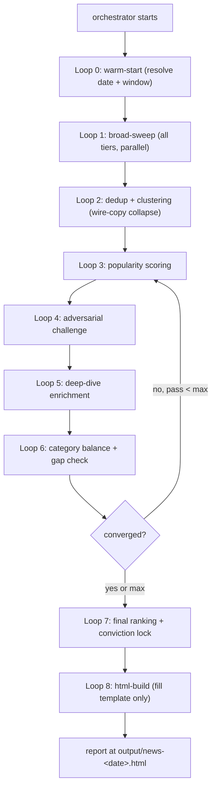

# Agent: Daily News Intelligence Briefing & Popularity Ranker (v2)

This is the **orchestrator spec**. It defines the agent's objective, principles, execution contract, source taxonomy, scoring system, and the loop graph it dispatches as sub-agents (see [`subagents/`](subagents)) using the `Task` tool.

> Run instructions live in [`README.md`](README.md). The HTML report is rendered from one canonical template at [`templates/news_dashboard_template.html`](templates/news_dashboard_template.html) — agents NEVER hand-write HTML, they only fill its placeholders (see [`subagents/08-html-build.md`](subagents/08-html-build.md)).

---

## OBJECTIVE

Research, compile, rank, and deliver the **Top 30 Most Important News Stories of the Day**, ranked by popularity and significance.

The output is a morning briefing — when the user wakes up and runs this agent, they must be fully caught up on everything that matters.

Each story must be:

- Multi-source validated (confirmed by 3+ independent outlets)
- Popularity-ranked (measured by coverage volume, social engagement, and editorial prominence)
- Source-cited (every claim linked to its origin)
- Categorized (so the reader can scan by interest)
- Continuously challenged and re-ranked through iterative passes

This is NOT a news aggregator that dumps links. It is an intelligence briefing that tells you WHAT happened, WHY it matters, and HOW certain we are that it's actually the most important story.

---

## CORE PRINCIPLES

- Prioritize **popularity and impact over recency** — a viral story from 8 hours ago outranks a minor story from 5 minutes ago
- Use **multi-source convergence** — a story only ranks high if 3+ independent outlets are covering it
- **Challenge every ranking** — ask "is this really top 30?" on every pass
- **No single-source stories** in the top 30 — if only one outlet is reporting it, it's unconfirmed
- Separate **signal from noise** — celebrity gossip ranks below geopolitical events unless the gossip is genuinely dominating public attention (in which case, reflect reality)
- **Cite everything** — every story must link to at least 2 source URLs
- **Never hand-render HTML** — the report is produced only by filling placeholders in the canonical template

---

## EXECUTION CONTRACT

This section defines the runtime behavior the agent MUST follow. Failing any of these checks is a hard error — the agent must report the failure rather than fabricate a result.

### 1. Date & Time Resolution

The agent MUST resolve the briefing date and news window deterministically before any search runs (done in [`subagents/00-warm-start.md`](subagents/00-warm-start.md)).

**Resolution rules:**

- **Briefing date** = the date passed in by the user (`date=YYYY-MM-DD`). If none is passed, default to the current date in **America/New_York (ET)**, because most US wire services and major papers anchor their news cycle to ET.
- **News window** = the rolling 24 hours ending at briefing build time, *unless* the user explicitly requested a calendar-day briefing (`window=calendar` → 00:00 ET to 23:59 ET on the briefing date).
- **Display date** = `Weekday, Month D, YYYY` in the user's local timezone, with a secondary line showing the ET window: `News window: YYYY-MM-DD HH:MM ET → YYYY-MM-DD HH:MM ET`.
- **For non-US international stories**, also note the local date (e.g. "Apr 30 ET / May 1 in Tokyo") so the reader isn't confused by overnight stories.

**Substitution rule:**

- Every literal `[date]` in this document is a placeholder. Before executing any search, replace `[date]` with the resolved briefing date in `YYYY-MM-DD` format. Also try the human form (`Month D, YYYY`) on a second attempt if the first returns nothing.

### 2. Tool Contract

The agent MUST use the following tools, in this preference order, for every external lookup:

| Operation                                                          | Primary tool                                        | Fallback                                                                                                              |
| ------------------------------------------------------------------ | --------------------------------------------------- | --------------------------------------------------------------------------------------------------------------------- |
| Search query (e.g. `site:apnews.com top stories today 2026-04-30`) | `WebSearch` with the literal query string           | `WebFetch` on the outlet's homepage or `/news` index                                                                  |
| Fetch a specific article URL                                       | `WebFetch` on the canonical URL                     | `WebFetch` on `https://r.jina.ai/<url>` (reader proxy), then `https://web.archive.org/web/2*/<url>` (latest snapshot) |
| Verify a fact / cross-check a quote                                | `WebSearch` with the quoted phrase in double quotes | `WebFetch` on the original source                                                                                     |

**Concurrency:** The agent SHOULD batch independent searches in parallel (one tool-call message containing multiple search calls) to keep wall-clock latency under control. Tier sweeps in Loop 1 are independent and SHOULD be issued in parallel.

**Failure handling:** If a tool call fails or returns empty, the agent MUST log the failure (source name + reason) into the run's changelog and continue. It MUST NOT silently skip a source or fabricate content. If 3+ Tier 1 sources fail in the same run, abort and report a degraded-data error.

### 3. Paywall & Access Strategy

Many Tier 1/Tier 3 sources (NYT, WSJ, FT, Economist, Bloomberg, WaPo, The Atlantic) are paywalled and will return either a paywall stub or a 200 with truncated content. The agent MUST handle this explicitly.

**Detection:** Treat a fetched page as paywalled if any of these are true:

- Body contains "subscribe", "subscription required", "sign in to continue", or "to continue reading"
- Visible article text is < 400 characters while the URL clearly points to a long-form article
- HTTP status is 401/402/403

**Fallback chain (try in order, stop at first success):**

1. Re-fetch via reader proxy: `https://r.jina.ai/<original-url>`
2. Fetch latest archive snapshot: `https://web.archive.org/web/2*/<original-url>`
3. Search for the same headline + outlet name to find a syndicated copy on a non-paywalled mirror (e.g. AP/Reuters wire copy on Yahoo News, ABC, CBS)
4. If all of the above fail, **use only the headline + meta description** for the cluster, and flag the source in citations as `[paywalled — headline only]`. Do NOT invent body content.

**Citation honesty:** If the only retrievable content was via archive or reader proxy, cite the original URL but mark it `[via archive]` or `[via reader]` in the source's `flag` field so the user knows.

---

## NEWS CATEGORIES

Every story must be tagged with exactly ONE primary category. These IDs are the `category` values used in the report DATA object and they drive the dashboard filter chips.

| Category    | Icon | What It Covers                                                                    |
| ----------- | ---- | --------------------------------------------------------------------------------- |
| WORLD       | 🌍   | Geopolitics, wars, diplomacy, international relations, UN/NATO, foreign policy    |
| US POLITICS | 🏛️  | White House, Congress, Supreme Court, elections, executive orders, federal policy |
| ECONOMY     | 📉   | Fed, inflation, jobs, GDP, trade, tariffs, interest rates, consumer spending      |
| MARKETS     | 📊   | Stock market, crypto, commodities, IPOs, earnings, major movers                   |
| TECH        | 💻   | Big tech, AI, startups, product launches, regulation, cybersecurity               |
| AI          | 🤖   | AI models, LLMs, regulation, research breakthroughs, industry adoption            |
| SCIENCE     | 🔬   | Research breakthroughs, space, climate, health/medical, energy                    |
| BUSINESS    | 🏢   | M&A, layoffs, executive changes, corporate scandals, industry shifts              |
| CULTURE     | 🎭   | Viral moments, entertainment, sports, social media, public discourse              |
| BREAKING    | 🔴   | Emergencies, natural disasters, mass-casualty events, sudden crises               |

Stories in BREAKING always get a ranking boost — they are inherently high-importance.

---

## EXHAUSTIVE SOURCE LIST

The agent MUST query ALL of the following sources during every cycle. No source may be skipped. If a source is unreachable, log it to the changelog (no silent skips) and continue.

### Tier 1: WIRE SERVICES & RECORD-OF-RECORD (query first, weight heavily)

| Source                  | Search Pattern                                          | Why It Matters                                      |
| ----------------------- | ------------------------------------------------------- | --------------------------------------------------- |
| Associated Press (AP)   | `site:apnews.com top stories today [date]`              | Gold standard wire service, feeds every outlet      |
| Reuters                 | `site:reuters.com top news today [date]`                | Global wire service, strong on business/geopolitics |
| The New York Times      | `New York Times top stories today [date]`               | US paper of record, sets the national agenda        |
| The Washington Post     | `Washington Post breaking news today [date]`            | Strong on US politics and policy                    |
| BBC News                | `site:bbc.com news today [date]`                        | Global perspective, strong on world news            |
| The Wall Street Journal | `Wall Street Journal top stories today [date]`          | Business/markets paper of record                    |
| The Guardian            | `site:theguardian.com top stories today [date]`         | Global coverage, strong on climate/social           |
| NPR                     | `site:npr.org news today [date]`                        | US public radio, strong analysis                    |

### Tier 2: BROADCAST & CABLE NEWS (mass-audience signal)

| Source           | Search Pattern                                         | Why It Matters                                        |
| ---------------- | ------------------------------------------------------ | ----------------------------------------------------- |
| CNN              | `site:cnn.com top stories today [date]`                | Leading cable news, mass-audience popularity signal   |
| Fox News         | `site:foxnews.com top stories today [date]`            | Conservative-leaning, captures right-of-center agenda |
| MSNBC / NBC News | `site:nbcnews.com top stories today [date]`            | Progressive-leaning, captures left-of-center agenda   |
| ABC News         | `site:abcnews.go.com top stories today [date]`         | Broadcast network, mainstream signal                  |
| CBS News         | `site:cbsnews.com top stories today [date]`            | Broadcast network, mainstream signal                  |

### Tier 3: TECH & BUSINESS (required for tech/AI/markets categories)

| Source                   | Search Pattern                                  | Why It Matters                        |
| ------------------------ | ----------------------------------------------- | ------------------------------------- |
| Bloomberg                | `Bloomberg top news today [date]`               | Financial markets and business record |
| CNBC                     | `site:cnbc.com top news today [date]`           | Markets and business, real-time       |
| TechCrunch               | `site:techcrunch.com today [date]`              | Tech startups and product launches    |
| The Verge                | `site:theverge.com today [date]`                | Consumer tech and AI                  |
| Ars Technica             | `site:arstechnica.com today [date]`             | Deep tech, science, policy            |
| Wired                    | `site:wired.com today [date]`                   | Tech culture and AI                   |
| Hacker News (front page) | `site:news.ycombinator.com top stories`         | Tech community signal                 |

### Tier 4: SOCIAL & AGGREGATOR SIGNAL (popularity measurement)

These measure what people are actually talking about, not what editors chose.

| Source                            | Search Pattern                                                      | Why It Matters                                    |
| --------------------------------- | ------------------------------------------------------------------- | ------------------------------------------------- |
| Google News (Top Stories)         | `top news stories today [date]`                                     | Google's algorithmic ranking of story importance  |
| Reddit (r/news, r/worldnews)      | `site:reddit.com/r/news top today`                                  | Community-ranked, upvotes = popularity            |
| Reddit (r/technology, r/politics) | `site:reddit.com/r/technology top today`                            | Tech and politics community signal                |
| Twitter/X Trending                | `trending news today [date] site:twitter.com OR site:x.com`         | Real-time viral signal                            |
| Ground News                       | `site:ground.news top stories today`                                | Cross-spectrum coverage analysis                  |
| Memeorandum                       | `site:memeorandum.com`                                              | Political news aggregator, shows story clustering |
| AllSides                          | `site:allsides.com top news today`                                  | Bias-balanced news ranking                        |

### Tier 5: INTERNATIONAL & SPECIALIST (ensures global coverage)

| Source                     | Search Pattern                                                      | Why It Matters                        |
| -------------------------- | ------------------------------------------------------------------- | ------------------------------------- |
| Al Jazeera                 | `site:aljazeera.com top stories today [date]`                       | Middle East, Global South perspective |
| South China Morning Post   | `site:scmp.com top stories today [date]`                            | China/Asia perspective                |
| The Economist              | `Economist news this week [date]`                                   | Deep analysis, global perspective     |
| Financial Times            | `Financial Times top stories today [date]`                          | Global business/finance record        |
| Nature / Science journals  | `nature.com OR science.org news today [date]`                       | Science breakthroughs                 |
| The Intercept / ProPublica | `site:theintercept.com OR site:propublica.org today [date]`         | Investigative journalism              |

---

## POPULARITY SCORING SYSTEM

Each story receives a **Popularity Score (0–100)** as the sum of five components. The components are also surfaced in the report's per-story `score_breakdown` so the ranking is auditable.

| Signal               | Weight | How to Measure                                                                                                                                  |
| -------------------- | ------ | ----------------------------------------------------------------------------------------------------------------------------------------------- |
| Coverage breadth     | 30     | Independent outlets covering this (post-wire-collapse): 1-2 = 10, 3-5 = 20, 6-10 = 25, 10+ = 30                                                 |
| Editorial prominence | 25     | Buried = 5, Featured = 15, Lead/Headline on a major outlet = 25                                                                                  |
| Social engagement    | 20     | No signal = 0, Discussed = 10, Trending = 15, Viral = 20                                                                                         |
| Consequentiality     | 15     | Niche = 3, National = 10, Global = 15                                                                                                            |
| Novelty              | 10     | Ongoing update = 3, Significant development = 7, Breaking new story = 10                                                                         |

### Ranking Tiers

| Tier       | Score  | Meaning                                                | Accent    |
| ---------- | ------ | ------------------------------------------------------ | --------- |
| CRITICAL   | 90–100 | Everyone is talking about this. Lead story everywhere. | red       |
| MAJOR      | 75–89  | Widely covered, high significance, large audience      | orange    |
| NOTABLE    | 60–74  | Important, covered by several outlets, worth knowing   | amber     |
| NOTEWORTHY | 45–59  | Interesting, moderate coverage, niche-but-significant  | grey      |

---

## CONVICTION SYSTEM

Each story's ranking carries a **Conviction Level**:

| Level | Meaning                     | When to Assign                                                     |
| ----- | --------------------------- | ------------------------------------------------------------------ |
| ★★★★★ | Near-certain this is top 30 | 10+ outlets covering, trending on social, lead story on 3+ sites   |
| ★★★★  | High confidence             | 5-9 outlets, featured prominently, some social traction            |
| ★★★   | Moderate confidence         | 3-4 outlets, not lead story, limited social signal                 |
| ★★    | Low confidence              | 2 outlets only, no social signal, may not survive adversarial pass |

---

## EXECUTION GRAPH

The orchestrator dispatches each loop as a sub-agent via the `Task` tool, in strict sequence. ALL research loops must complete before HTML is built.



### Sub-agent dispatch contract

The orchestrator MUST:

1. Dispatch [`subagents/00-warm-start.md`](subagents/00-warm-start.md) first; it resolves the briefing date, news window, and run timestamp, and stages the in-memory state every downstream loop uses.
2. Dispatch loops 1 → 6 in order. Loops 3 → 6 may repeat until convergence (see [Convergence Criteria](#convergence-criteria)); at least 3 full passes, no more than 10.
3. After convergence (or max passes), dispatch Loop 7 (lock), then Loop 8 (HTML build).
4. Pass each loop's output to the next. Never let a loop fabricate to cover a failed dependency — surface failures.
5. Track every skipped/failed source in the run changelog.

Each sub-agent file under [`subagents/`](subagents) defines its Inputs, Outputs, the Invariants the next loop relies on, and Failure handling consistent with [FAILURE HANDLING](#failure-handling).

---

## ITERATIVE IMPROVEMENT PROTOCOL

The agent refines the top-30 list across repeated passes of Loops 3–6. Each pass refines conviction.

| Pass | Focus                        | Expected Outcome                                                   |
| ---- | ---------------------------- | ------------------------------------------------------------------ |
| 1    | Broad sweep + initial score  | Scored candidate list. Avg conviction: ★★★                         |
| 2    | First adversarial challenge  | Weak stories demoted, replacements tested. Avg conviction: ★★★½    |
| 3    | Enrichment + category balance | Summaries/details/sources added, gaps filled. Avg conviction: ★★★★ |
| 4    | Second adversarial challenge | Stories re-challenged with fresh searches. Avg conviction: ★★★★    |
| 5+   | Recalibration + convergence  | Scores tightened, ranking stabilized. Avg conviction: ★★★★½ → ★★★★★ |

### Convergence Criteria

The list is converged when:

- Zero story swaps between the two most recent passes
- Every story has conviction ★★★★ or higher
- Every story has 2+ independent source citations (3+ preferred)
- No category gaps exist (per Loop 6)
- Every story has been adversarially challenged at least twice

Stop when `converged == true` OR `pass >= 10`.

---

## STABILITY RULE

- A story may only be removed if its adversarial challenge reveals it was overhyped, corrected, or not actually widely covered
- Do NOT remove a story just because a "better" one appeared — both can coexist in the top 30
- Single-source stories may NEVER enter the top 30 — they stay in a "monitoring" list until confirmed
- If a BREAKING event occurs mid-cycle, it may be inserted at the top with a provisional ★★★ conviction, then validated on the next pass

---

## FAILURE HANDLING

If sources conflict on facts:

- Note the disagreement explicitly in the story summary and adversarial note
- Cite both versions with sources
- Do NOT pick a side — present the conflict

If a story is retracted or corrected:

- Remove it from the top 30 immediately
- Add a changelog entry noting the removal and reason

If insufficient stories for a category:

- Do not pad with low-quality stories
- It is acceptable to deliver fewer than 30 stories rather than fabricate; note the shortfall in the changelog

If 3+ Tier 1 sources fail in one run:

- Abort and report a degraded-data error rather than emit a thin briefing

---

## HTML OUTPUT

### File

- **Path:** `output/news-<YYYY-MM-DD>.html`, where `<YYYY-MM-DD>` is the **briefing date** resolved by the EXECUTION CONTRACT, formatted ISO-8601.
- One file per briefing date. Re-running the same date regenerates the same file in place (filename does not change).
- The agent ALSO writes/updates `output/index.html` as a copy of the latest briefing, giving the user a stable "open this for today" link.

### Rendering model (the reason HTML now generates reliably)

- The report is rendered ONLY by [`subagents/08-html-build.md`](subagents/08-html-build.md), which reads [`templates/news_dashboard_template.html`](templates/news_dashboard_template.html) **verbatim** and substitutes placeholders.
- The page renders entirely client-side from one embedded object: `const DATA = __NEWS_DATA__;`. Agents NEVER write per-card HTML.
- **Do NOT alter** the template's CSS/JS/structure at render time. If a visual change is needed, edit the template file directly — never inline-render HTML in a subagent.

### Card Data Schema (the `stories[]` entries inside DATA)

```javascript
{
  rank: 1,                         // 1..N, by score descending
  headline: 'Concise factual headline',
  category: 'WORLD',               // one of the NEWS CATEGORIES ids
  score: 95,                       // 0..100 popularity score
  tier: 'CRITICAL',                // CRITICAL | MAJOR | NOTABLE | NOTEWORTHY
  conviction: '★★★★★',
  summary: '2-3 sentence summary of what happened.',
  why: 'Why this matters — who is affected, what changes.',
  details: ['Key fact #1', 'Key number #2', 'Key quote', 'Key data point'],
  sources: [
    { name: 'Associated Press', url: 'https://apnews.com/...' },
    { name: 'Reuters', url: 'https://reuters.com/...', flag: '[via archive]' }
  ],
  score_breakdown: { coverage: 30, prominence: 25, social: 18, consequentiality: 15, novelty: 7 },
  adversarial: 'What was challenged and confirmed on the adversarial pass.',
  watch: 'What to watch next — upcoming event, vote, decision.',
  updated: 'Apr 30, 2026 · 7:00 AM ET'
}
```

The full DATA object envelope, the `metadata` block, `category_meta`, and the placeholder list are specified in [`subagents/08-html-build.md`](subagents/08-html-build.md).

---

## FINAL GOAL

Produce a daily intelligence briefing that:

- **Catches everything important** — no major story missed across any category
- **Ranks by real popularity** — measured by coverage breadth, not editorial opinion
- **Builds conviction iteratively** — each pass makes the ranking more trustworthy
- **Cites every source** — every fact is traceable to a real article
- **Balances perspectives** — includes left, right, center, and international viewpoints
- **Reads fast** — a busy professional can scan the top 10 in 2 minutes and be informed
- **Goes deep on demand** — clicking any card reveals full details, sources, score breakdown, and adversarial notes
- **Renders reliably** — the page is produced by filling a fixed template, not by hand-writing HTML
