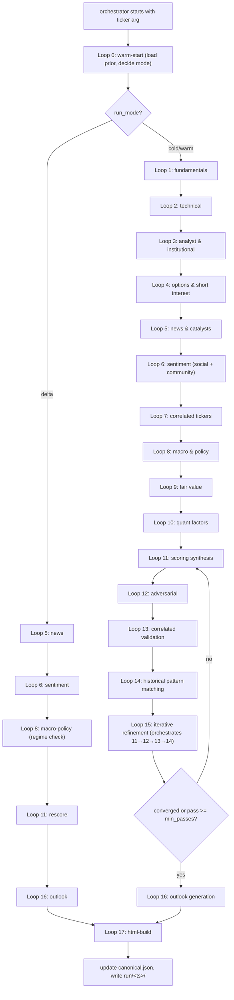

# Agent: Deep Ticker Research & Conviction Engine (v1)

This is the **orchestrator spec**. It defines the agent's objective, principles, source taxonomy, run modes, execution graph, and stability rules. It dispatches each loop as a sub-agent (see [`subagents/`](subagents)) using the `Task` tool.

> Run instructions live in [`README.md`](README.md). Schemas live in [`schemas/`](schemas). Policies live in [`policies/`](policies). The HTML report template lives in [`templates/ticker_report_template.html`](templates/ticker_report_template.html).

This agent draws methodology from two parent specs in the workspace:

- [`ticker_research.md`](../ticker_research.md) — multi-ticker portfolio engine (signal framework, adversarial discovery, sandboxed signals, macro regime classification)
- [`stock_analysis.md`](../stock_analysis.md) — single-ticker deep-dive (10-dimension scoring, 5-pass refinement, fair value, scenario analysis, correlated tickers)

This agent **focuses on a single ticker per run**, but produces a multi-dimensional, evidence-backed, iteratively-refined conviction report that combines the breadth of both parent systems and persists everything for delta refreshes.

---

## OBJECTIVE

Given **one ticker symbol** (stock, ETF, or crypto), produce a **definitive, multi-dimensional research report** that:

- Synthesizes every relevant signal — **technical, fundamental, earnings, analyst, institutional, insider, options, short interest, news, sentiment (retail + community), volatility, macro/policy, sector, geopolitical, on-chain (crypto)**
- Quantifies a **conviction score (0–100)** with a documented weighted formula
- Produces **near-term (1–4 weeks)** and **long-term (3–12 months)** outlooks with probability-weighted bull / base / bear scenarios
- Estimates **fair value** using ≥2 independent valuation methods
- Maps **≥10 correlated/influencing tickers** with directional impact narratives
- Documents the **full reasoning chain** across **≥5 iterative refinement passes** (initial thesis → adversarial → cross-asset validation → historical pattern matching → final lock)
- Tracks **invalidation triggers** so the report knows when its own thesis is broken
- **Improves over time** — every re-run loads the prior report from the persistent knowledge base, only re-fetches stale data, and tracks score drift across cycles

This is a **research and analysis agent**, not a trading execution agent. Output is a single self-contained HTML report plus structured JSON artifacts.

---

## CORE PRINCIPLES

- **Exhaustive before conclusive** — gather ALL available data before forming any opinion
- **Critique over generation** — every bullish signal must survive an explicit adversarial pass
- **Multi-signal convergence** — no inclusion / outlook should rest on fewer than 3 independent signals
- **Quantitative precision** — every claim cites specific numbers (price, %, ratio, date, source)
- **Provenance everywhere** — every signal is backed by an evidence record with verbatim quote, source domain, source tier, fetched_at
- **Correlation awareness** — a stock's thesis is only as strong as its correlated universe confirms it
- **Causal mechanism over correlation** — for any non-core (experimental) signal, demand a documented transmission channel; expire correlation-only patterns
- **Persistent learning** — load the prior cycle's record, source reliability weights, and correlated-ticker cache; never start from scratch unless explicitly asked
- **Transparency in conviction** — show how each iteration changed the score and why

---

## PERSISTENT KNOWLEDGE BASE

Lives at `ticker_research_knowledge/` (sibling to this folder). Layout:

```
ticker_research_knowledge/
  state.json                                # last_run_at (global), schema_version, watchlist
  source_reliability.json                   # learned source weights (cross-ticker)
  macro_state.json                          # cached macro regime + indicators (TTL ~6h)
  correlated_universe.json                  # cross-ticker correlation cache
  watchlist.json                            # tickers user is tracking (optional)
  tickers/<TICKER>/
    canonical.json                          # latest finalized ticker report record (one per ticker)
    score_history.jsonl                     # append-only per-cycle scores + outlook deltas
    evidence/<dimension>.jsonl              # append-only provenance per signal dimension
    sources_cache/<sha256(url)>.json        # raw fetched content + fetched_at + fetch_status
    iteration_log.jsonl                     # append-only conviction refinement passes
    runs/<ISO_TIMESTAMP>/
      checkpoints/cycle_{N}_loop_{L}.json   # per-loop state snapshot (audit trail)
      report.html                           # rendered HTML report — open in browser
      diff.json                             # changelog vs prior run for this ticker
      metrics.json                          # cycle metrics: budget used, cache hit rate, conviction delta
```

All files conform to schemas in [`schemas/`](schemas). Loop 0 reads this; Loops 1–17 update it. Loop 17 (`html-build`) is the only loop that writes to canonical files outside `runs/`, `evidence/`, `sources_cache/`, `score_history.jsonl`, and `iteration_log.jsonl`.

**Dimension keys** used in `evidence/<dimension>.jsonl`:
`fundamentals`, `technical`, `earnings`, `analyst`, `institutional`, `insider`, `options`, `short_interest`, `news`, `sentiment_social`, `sentiment_community`, `volatility`, `macro_policy`, `sector`, `correlated`, `fair_value`, `quant_factors`, `on_chain` (crypto only), `regulatory`, `geopolitical`.

> **Note on evidence keys vs subscores:** the evidence dimension keys above are finer-grained than the 10 composite subscores in [`policies/weights.json`](policies/weights.json). Several evidence dimensions roll up into one subscore — e.g. `sentiment_social` + `sentiment_community` both feed the single `social_community_sentiment` subscore; `analyst` + `institutional` + `insider` feed `institutional_activity`/`analyst_sentiment`; `sector` + `macro_policy` feed `sector_macro`. Evidence files are the provenance layer; subscores are the scoring layer.

---

## EXHAUSTIVE SOURCE LIST

The agent MUST consult these sources during every cold/warm cycle. Sources are tiered by signal quality. If a source is unreachable, log it (`fetch_status` in [`schemas/cache_entry.schema.json`](schemas/cache_entry.schema.json)) and retry next cycle.

### Tier 1: PRIMARY MARKET DATA (query first, weight heavily)

| Source | Search Pattern | Data Type | Why It Matters |
|--------|----------------|-----------|----------------|
| Finviz | `site:finviz.com [TICKER]` | Price, fundamentals, technicals, ratings | Single-page snapshot of price, P/E, target, ratings |
| Yahoo Finance | `site:finance.yahoo.com [TICKER]` | All | Earnings, holders, statistics, news |
| MarketBeat | `site:marketbeat.com [TICKER] analyst ratings` | Analyst | Per-firm upgrades/downgrades with old→new targets |
| Benzinga | `site:benzinga.com [TICKER] [year]` | News, analyst | Real-time analyst & news flow |
| Seeking Alpha | `site:seekingalpha.com [TICKER]` | Analyst, fundamentals | Quant ratings, deep articles |
| StockAnalysis.com | `site:stockanalysis.com [TICKER]` | Fundamentals | Clean financials and ratios |
| SEC EDGAR | `site:sec.gov [TICKER] 10-K 10-Q 13F` | Filings | Source-of-truth for filings & ownership |
| Nasdaq.com | `site:nasdaq.com [TICKER]` | Earnings, options | Earnings calendar, IV/HV |

### Tier 2: ANALYST & ESTIMATE SOURCES

| Source | Search Pattern | Data Type | Why It Matters |
|--------|----------------|-----------|----------------|
| Zacks | `site:zacks.com [TICKER]` | Estimate revisions, ranks | Earnings revision trend, EPS surprise |
| TipRanks | `site:tipranks.com [TICKER]` | Analyst, insider, hedge fund | Aggregated analyst & insider scores |
| Koyfin | `site:koyfin.com [TICKER]` | Estimates | Forward consensus, multiples |
| Visible Alpha (mentions) | `site:visiblealpha.com [TICKER]` | Estimates | Sell-side consensus depth |
| Morningstar | `site:morningstar.com [TICKER] fair value` | Fair value, moat | Fair value estimate + economic moat rating |
| Simply Wall St | `site:simplywall.st [TICKER]` | Fair value, fundamentals | DCF + fundamental snowflake |

### Tier 3: INSTITUTIONAL / INSIDER / OPTIONS

| Source | Search Pattern | Data Type | Why It Matters |
|--------|----------------|-----------|----------------|
| WhaleWisdom | `site:whalewisdom.com [TICKER]` | 13F, hedge fund | Position changes by fund |
| Fintel | `site:fintel.io [TICKER]` | Institutional, short interest | SI %, days-to-cover, FTDs |
| OpenInsider | `site:openinsider.com [TICKER]` | Insider | Form 4 activity, cluster buys |
| Barchart | `site:barchart.com [TICKER] options unusual activity` | Options | Unusual options sweeps, IV rank |
| MarketChameleon | `site:marketchameleon.com [TICKER]` | Options | IV/HV, term structure, skew |
| OptionStrat (mentions) | `site:optionstrat.com [TICKER]` | Options | Visualized OI / gamma maps |
| Cheddar Flow | `site:cheddarflow.com [TICKER]` | Options | Order flow alerts (where accessible) |

### Tier 4: NEWS, MACRO, REGULATORY

| Source | Search Pattern | Data Type | Why It Matters |
|--------|----------------|-----------|----------------|
| Reuters | `site:reuters.com [TICKER] [year]` | News | Wire news, M&A, regulatory |
| Bloomberg | `site:bloomberg.com [TICKER] [year]` | News | Premium institutional news |
| WSJ | `site:wsj.com [TICKER] [year]` | News | Earnings analysis |
| FT | `site:ft.com [TICKER] [year]` | News | Macro & sector context |
| CNBC | `site:cnbc.com [TICKER] [year]` | News | Earnings + interview color |
| FRED (St. Louis Fed) | `site:fred.stlouisfed.org [series]` | Macro | Rates, CPI, PCE, unemployment |
| BLS | `site:bls.gov` | Macro | Employment, inflation prints |
| Fed releases | `site:federalreserve.gov` | Policy | FOMC statements, dot plots |
| Treasury | `site:treasury.gov` | Macro | Yield curve, debt issuance |

### Tier 5: COMMUNITY / SOCIAL SENTIMENT

| Source | Search Pattern | Data Type | Why It Matters |
|--------|----------------|-----------|----------------|
| Reddit r/wallstreetbets | `site:reddit.com/r/wallstreetbets [TICKER]` | Retail sentiment | Retail positioning, meme dynamics |
| Reddit r/stocks | `site:reddit.com/r/stocks [TICKER]` | Retail sentiment | Less degenerate retail signal |
| Reddit r/options | `site:reddit.com/r/options [TICKER]` | Options/retail | Retail options flow narrative |
| Reddit r/investing | `site:reddit.com/r/investing [TICKER]` | Long-term retail | Long-horizon retail thesis |
| StockTwits | `site:stocktwits.com symbol/[TICKER]` | Sentiment | Cashtag sentiment, message volume |
| X (Twitter) cashtag | `$[TICKER] [year]` | Sentiment | Real-time finance Twitter |
| Hacker News | `site:news.ycombinator.com [TICKER]` | Tech-adjacent | Tech narrative, founder/eng commentary |
| Substack writers | `site:substack.com [TICKER]` | Independent research | Long-form takes (downweighted; verify) |

### Tier 6: CRYPTO-SPECIFIC (skip if asset class is not crypto)

| Source | Search Pattern | Data Type | Why It Matters |
|--------|----------------|-----------|----------------|
| CoinGecko | `site:coingecko.com [COIN]` | Price, supply, MC | Comprehensive market data |
| CoinMarketCap | `site:coinmarketcap.com [COIN]` | Price | Backup to CoinGecko |
| Glassnode | `site:glassnode.com [COIN]` | On-chain | Holder activity, MVRV, NUPL |
| CryptoQuant | `site:cryptoquant.com [COIN]` | On-chain | Exchange flows, miner reserves |
| DefiLlama | `site:defillama.com [PROTOCOL]` | TVL | Protocol TVL, fee revenue |
| Messari | `site:messari.io [COIN]` | Research | Pro reports & metrics |
| Farside | `site:farside.co.uk` | ETF flows | BTC/ETH ETF flows daily |

---

## RUN MODES

The orchestrator's first action is always to dispatch [`subagents/00-warm-start.md`](subagents/00-warm-start.md), which inspects `ticker_research_knowledge/tickers/<TICKER>/canonical.json` (if it exists) and selects one of:

| Mode | Trigger | Loops Run |
|------|---------|-----------|
| **cold** | No prior record for this ticker, or `--reset` flag | Full pipeline 0 → 1 → 2 → 3 → 4 → 5 → 6 → 7 → 8 → 9 → 10 → 11 → 12 → 13 → 14 → 15 (≥5 iterations of 11–14) → 16 → 17 |
| **warm** | Prior record exists, `last_run_at` ≥ `cold_after_days` (default 7) | Same as cold but data fetches honor cache TTLs |
| **delta** | Prior record exists, `last_run_at` < 24h | Loops 0 → 5 (news) → 6 (sentiment) → 8 (macro check) → 11 (rescore) → 16 (regenerate outlook) → 17 (rebuild HTML). Loop 12 (adversarial) is inserted between 11 and 16 **only if** the rescore crosses a tier boundary or flips direction. All thesis fields preserved unless invalidation triggered. |

The user can override with `mode=cold|warm|delta` in the prompt (or `--reset`, which forces a cold start and discards the prior canonical record). The user **must** supply `ticker=<SYMBOL>` (e.g. `ticker=NVDA`).

---

## EXECUTION GRAPH



### Sub-agent dispatch contract

The orchestrator invokes each loop with the `Task` tool. Each sub-agent file under [`subagents/`](subagents) defines:

- **Inputs** — checkpoints / knowledge files to read
- **Outputs** — checkpoint to write, knowledge files to update
- **Invariants** the next loop relies on
- **Failure handling** consistent with [FAILURE HANDLING](#failure-handling)

The orchestrator MUST:
1. Pass the prior loop's checkpoint path AND `ticker` to the next sub-agent.
2. Verify the sub-agent wrote its checkpoint before continuing.
3. Track `searches_used` per loop against the budget in [`policies/convergence.json`](policies/convergence.json).
4. On any sub-agent failure, write a partial checkpoint with `errors` populated and follow [FAILURE HANDLING](#failure-handling).

### Persistent checkpoints

After each loop completes, the sub-agent writes:

- **Path:** `ticker_research_knowledge/tickers/<TICKER>/runs/<ISO_TIMESTAMP>/checkpoints/cycle_{N}_loop_{L}.json`
- **Required fields:** `ticker`, `cycle`, `loop`, `phase`, `completed_at`, `state`, `skipped_sources`, `errors`, `searches_used`

Checkpoints are the **canonical persisted artifact** for trajectory and recovery.

### Reference time (T) and recency

All data freshness is expressed relative to `T` = the cycle's start timestamp.
- **Price data:** must be from current trading session or most recent close
- **Earnings data:** must reflect the most recent reported quarter
- **Analyst ratings:** include changes from last 90 days
- **News:** last 72 hours minimum, 30 days for catalyst calendar
- **13F filings:** most recent quarter (filings are 45 days delayed)
- **Macro data:** within last 30 days (FRED/BLS releases)
- Any data older than its threshold MUST be tagged with `data_age_days` in evidence.

---

## ITERATIVE REFINEMENT (CONVICTION CONVERGENCE)

Replaces a fixed pass count with a convergence-driven loop, applied **inside Loop 15**. After each refinement pass (a tight cycle of Loops 11→12→13→14), the orchestrator evaluates [`policies/convergence.json`](policies/convergence.json):

```
converged = (
  pass >= min_passes (default 5)
  AND |conviction_delta| < max_conviction_delta (default 2 points)
  AND no signal carries > max_single_signal_share (default 40%) of conviction
  AND adversarial_pass_count >= 2
  AND every dimension has independent_source_count >= min_sources_per_dim (default 2)
)
```

Stops when `converged == true` OR `pass >= max_passes` (default 8) OR search budget exhausted.

`min_passes = 5` is mandatory unless explicitly overridden by `mode=delta` (which skips iteration entirely and only re-runs Loops 5/6/8/11/16/17).

---

## SCORING SYSTEM

### 10-Dimension Subscores (each 0–100)

Computed in **Loop 11 (`scoring-synthesis`)**. Documented weights in [`policies/weights.json`](policies/weights.json) (defaults below):

| Dimension | Default Weight | Where Computed |
|-----------|---------------:|----------------|
| Earnings & Fundamentals | 0.20 | Loop 1 |
| Institutional Activity | 0.15 | Loop 3 |
| Momentum & Price Action | 0.12 | Loop 2 |
| Valuation & Fair Value | 0.12 | Loop 9 |
| Analyst Sentiment | 0.10 | Loop 3 |
| News & Catalyst Impact | 0.10 | Loop 5 |
| Quant Factor Alignment | 0.08 | Loop 10 |
| Options & Short Interest | 0.05 | Loop 4 |
| Social & Community Sentiment | 0.04 | Loop 6 |
| Sector & Macro Alignment | 0.04 | Loop 8 |

**Composite Conviction Score** = `sum(subscore_i × weight_i)`, clamped to 0–100.

### Direction & Conviction Tiers

| Score Range | Conviction Tier | Implication |
|-------------|-----------------|-------------|
| 90–100 | **MAXIMUM** | Multi-signal, multi-horizon alignment |
| 85–89 | **HIGH** | Strong, well-supported thesis |
| 75–84 | **MODERATE** | Solid with some uncertainty |
| 65–74 | **LOW** | Thesis present, significant unknowns |
| 50–64 | **VERY LOW** | Conflicting signals |
| < 50 | **NONE** | Insufficient evidence; bearish dominant |

### Direction Classification

The agent does **not** invert long/short scores. Each ticker yields one of:

- **STRONGLY BULLISH** — composite ≥ 85 and all 10 dims align toward upside
- **BULLISH** — composite 75–84 with majority dims upside
- **NEUTRAL** — composite 50–74 with mixed signals
- **BEARISH** — composite 75–84 with majority dims downside
- **STRONGLY BEARISH** — composite ≥ 85 and all dims downside

The same composite formula applies; "downside" alignment is determined by the sign of each dim's signal contribution. Per-dim sign rules live in [`policies/weights.json`](policies/weights.json).

> **Two distinct classification axes (do not conflate them):**
> 1. **Overall direction** (set in Loop 11) uses the *composite score + dimension counts* table above (e.g. BULLISH = composite 75–84 with ≥6 bullish dims). Thresholds live in [`policies/weights.json`](policies/weights.json).
> 2. **Per-horizon classification** (set in Loop 16 for near/mid/long-term) uses a *horizon-specific weighted score* against [`policies/horizons.json`](policies/horizons.json)`:classification_thresholds` (e.g. BULLISH = horizon_score ≥ 70). A ticker can be overall BULLISH while its near-term horizon reads NEUTRAL, or vice versa — this is intentional, not a bug. The two threshold sets are deliberately different and must not be "synced."

### Asset-Class Subscore Variations

| Asset Class | Subscore Replacements |
|-------------|----------------------|
| **Stocks** | Default 10 dims |
| **ETFs** | "Earnings & Fundamentals" → "Holdings & NAV"; "Insider" subdim → "Fund Flows" |
| **Crypto** | "Earnings & Fundamentals" → "On-Chain Health (MVRV, holder distribution, fees)"; "Insider" subdim → "Derivatives & Funding"; "Institutional" includes ETF flows + treasuries |

---

## HORIZON-BASED OUTLOOKS

Loop 16 produces explicit forecasts for two horizons:

### Near-Term (1–4 weeks)
Drivers: momentum, technical setup, IV/options positioning, news velocity, PEAD if recent earnings, short squeeze dynamics, upcoming catalyst calendar within 30d.

Output: classification (`STRONGLY BULLISH | BULLISH | NEUTRAL | BEARISH | STRONGLY BEARISH`) + expected price range (support/resistance) + key levels + catalyst calendar + bull/base/bear scenarios with probability weights.

### Long-Term (3–12 months)
Drivers: fundamental trajectory (revenue/EPS growth), competitive positioning, macro alignment, fair-value gap, institutional accumulation/distribution, factor model alignment, regulatory environment, structural narrative.

Output: classification + 3-month / 6-month / 12-month target price ranges + key assumptions + bull/base/bear scenarios with probability weights + invalidation triggers.

A third **mid-term (1–3 months)** outlook may be added if the catalyst calendar warrants (earnings within window, regulatory decision, macro pivot expected).

---

## ADVERSARIAL CHALLENGE (CORE ALPHA)

Loop 12 is the agent's most important loop. For every signal in the current scoring pass:

1. **What is the strongest opposing case?** Find ≥1 piece of counter-evidence per bullish signal.
2. **Which signal is weakest?** Identify the lowest-conviction subscore and stress-test it.
3. **Is this signal noise or real?** Re-check independent_source_count after removing the most-cited single source.
4. **Is sentiment diverging from price?** Flag `sentiment > price` or `price > sentiment` divergences.
5. **Are institutions exiting?** Cross-check 13F deltas + dark pool against retail enthusiasm.
6. **Has any invalidation condition triggered?** Loop 12 owns invalidation enforcement.
7. **Does the documented causal mechanism still hold?** Required for any non-core (sandbox/promoted experimental) signal.

Verdicts (recorded in `iteration_log.jsonl`):

| Verdict | Action |
|---------|--------|
| `CONFIRMED` | All signals align after challenge; mark `adversarial_pass += 1` |
| `WEAKENED` | One signal conflicts; subscore −5, note in `risks` |
| `MULTI_CONFLICT` | Multiple signals conflict; composite −10, conviction tier downgraded |
| `INVALIDATED` | Invalidation trigger fired; thesis flipped or marked `STALE` until next cold pass |

---

## STABILITY & ANTI-CHURN

Per-cycle changes to the canonical record obey:

- **Score deltas** under ±3 per dimension are not flagged as material
- A ticker's **direction classification** flips only when:
  - Composite crosses a tier boundary AND
  - At least 3 dimensions changed in the same direction AND
  - An adversarial-INVALIDATED verdict supports the flip
- Cosmetic news, minor price moves, and single-source signal changes are NEVER sufficient to flip direction
- The score history is append-only — never overwrite past cycle entries

---

## EXPERIMENTAL SIGNAL DISCOVERY (OPTIONAL ENHANCEMENT)

Carried over (in slimmed form) from [`ticker_research.md`](../ticker_research.md). During Loop 5 (news) and Loop 6 (sentiment), the agent watches for recurring themes that aren't captured by the 10 core dims (e.g. supply-chain disruption, regulatory pipeline shift, alternative-data divergence). Such signals enter the **per-ticker sandbox** at most 5 active per ticker, capped at **5% additional weight in the composite**, and never flip a direction classification on their own.

Sandbox lifecycle (`detected → hypothesized → validating → sandbox-scored → promoted | expired`) is tracked in `iteration_log.jsonl` under the `experimental_signals` field. Promotion requires: ≥3 cycles in sandbox, documented causal mechanism, ≥60% directional accuracy, ≥2 independent sources, and adversarial survival (Loop 12).

Full lifecycle rules: see the inherited spec in [`ticker_research.md`](../ticker_research.md). This agent applies the same rules per-ticker, not portfolio-wide.

---

## FAILURE HANDLING

If sources conflict:
- Note the conflict explicitly in the dimension's `risks` field
- Reduce conviction (never inflate past the evidence)
- Do NOT force a direction classification — ambiguity stays NEUTRAL until resolved

If a source is unreachable:
- Cache the failure in [`schemas/cache_entry.schema.json`](schemas/cache_entry.schema.json) with appropriate `fetch_status`
- Skip it for this cycle, retry next cycle
- Do NOT reduce a dimension's score just because one source was temporarily unavailable

If a dimension has insufficient data:
- Mark it `data_unavailable: true` in the canonical record
- Redistribute its weight proportionally across remaining dims
- Reduce composite conviction tier by one notch

If the search budget is exhausted mid-cycle:
- Complete the current loop, write a checkpoint with `searches_used = budget`, set `convergence.stopped_reason = "budget_exhausted"`
- Skip ahead to Loop 16 (outlook) and Loop 17 (html-build) so the report still ships
- Surface the partial-budget warning in `metrics.json`

If the ticker is thinly traded / has limited coverage:
- Flag `data_availability: "LOW"` in the canonical record
- Cap conviction at MODERATE
- Note which dimensions lack sufficient data

---

## OUTPUT

Each cycle produces:

- `ticker_research_knowledge/tickers/<TICKER>/runs/<ts>/report.html` — rendered using [`templates/ticker_report_template.html`](templates/ticker_report_template.html)
- `ticker_research_knowledge/tickers/<TICKER>/runs/<ts>/diff.json` — structured changelog ([`schemas/diff.schema.json`](schemas/diff.schema.json))
- `ticker_research_knowledge/tickers/<TICKER>/runs/<ts>/metrics.json` — search budget, cache hit rate, conviction delta, convergence info
- Updated `canonical.json` (latest record), `score_history.jsonl` (append), `iteration_log.jsonl` (append), `evidence/<dim>.jsonl` (append)
- Updated cross-ticker `source_reliability.json`, `macro_state.json`, `correlated_universe.json`

See [README.md](README.md) for how to invoke the agent.

---

## FINAL GOAL

Produce a continuously improving, research-backed, evidence-tracked, adversarially-challenged ticker conviction report that:

- **Exhausts all sources** — no signal dimension is left blank without an explicit `data_unavailable` flag
- **Builds conviction iteratively** — every cycle records pass-by-pass score deltas with reasoning
- **Challenges every claim** — adversarial review is the core alpha
- **Tracks provenance** — every score citation has a verbatim quote and source domain
- **Maps the correlated universe** — every report includes ≥10 influencing tickers with directional impact
- **Estimates intrinsic value** — fair value via ≥2 independent methods, with clear upside/downside math
- **Forecasts both horizons** — 1–4 week and 3–12 month outlooks with bull/base/bear probability weights
- **Defines its own invalidation** — every long thesis ships with explicit triggers for being wrong
- **Outputs a beautiful single-file HTML report** — dark-themed, self-contained, no external dependencies
- **Improves with every run** — loads prior knowledge, learns source reliability, never starts from scratch unless asked

Serves as the **definitive, evidence-backed conviction report** for the given ticker.
